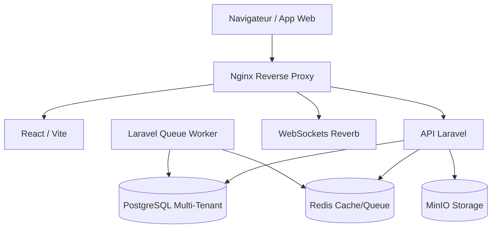

<div align="center">
  <h1>🎓 o-229 Education</h1>
  <p><strong>Plateforme SaaS Multi-Tenant de Gestion Scolaire Nouvelle Génération</strong></p>

  [](https://github.com/votre-user/o-229/actions/workflows/ci.yml)
  [](https://github.com/votre-user/o-229/actions/workflows/security.yml)
  [](https://php.net/)
  [](https://laravel.com/)
  [](https://reactjs.org/)
  [](#)
</div>

---

## 🌟 Présentation
**o-229 Education** est une plateforme SaaS complète, conçue pour dématérialiser et optimiser la gestion des établissements scolaires. Construite avec une architecture **multi-tenant**, elle garantit une isolation parfaite des données (une base de données ou un schéma par école) tout en mutualisant le code source.

## ✨ Fonctionnalités Clés
- 🏢 **Multi-Tenancy Isolé** : Environnements dédiés (ex: `ecole1.o-229.com`)
- 🔒 **Sécurité Avancée** : Roles/Permissions, Authentification MFA, Pre-commit scanners
- 🚀 **Performance** : Mise en cache via Redis, base de données PostgreSQL optimisée
- 📡 **Temps Réel** : WebSockets via Laravel Reverb
- 💾 **Stockage S3** : Gestion des fichiers via MinIO

## 🏗 Architecture Système



> **Consultez notre [Politique de Sécurité (SECURITY.md)](./SECURITY.md)** pour en savoir plus sur la gestion des vulnérabilités.

## 🚀 Quick Start (Docker)

L'environnement de développement complet est conteneurisé.

```bash
# 1. Cloner le projet et configurer les variables
cp .env.docker.example .env.docker

# 2. Préparer l'environnement de développement (Hooks Git, Husky)
chmod +x scripts/setup-dev.sh
./scripts/setup-dev.sh

# 3. Démarrer les services Docker
docker-compose up -d --build

# 3. Installer les dépendances backend
docker exec -it o229-app composer install

# 4. Préparer l'application
docker exec -it o229-app php artisan key:generate
docker exec -it o229-app php artisan migrate --seed
docker exec -it o229-app php artisan storage:link
```

**Accéder à l'application locale :**
- **API** : http://localhost/api/v1
- **WebSocket** : ws://localhost:8080
- **MinIO S3** : http://localhost:9001

## 🔧 Les Services (Docker-Compose)

| Service | Conteneur | Description |
|---------|-----------|-------------|
| **Nginx** | `o229-nginx` | Reverse Proxy & Serveur Web |
| **Laravel** | `o229-app` | API PHP-FPM (Port 9000 interne) |
| **PostgreSQL**| `o229-postgres` | Base de données v16 |
| **Redis** | `o229-redis` | Cache et Gestionnaire de Queues |
| **Worker** | `o229-queue` | Worker asynchrone |
| **Scheduler** | `o229-scheduler`| Cron jobs Laravel |
| **Reverb** | `o229-reverb` | Serveur WebSocket (Port 8080) |
| **MinIO** | `o229-minio` | Stockage de fichiers compatible S3 |

## 🛡 Qualité et CI/CD
L'application utilise un pipeline CI/CD GitHub Actions robuste :
- **Tests Automatisés** via PestPHP
- **Analyse Statique** via PHPStan / ESLint
- **Audit de Sécurité Automatique** des dépendances (`composer audit` / `npm audit`)
- **Dependabot** configuré pour le maintien des packages.
- **Hooks Git (Husky)** : Vérification de la stagiété du code (`lint-staged`) et détection de secrets (`gitleaks`) avant chaque commit.

> ⚠️ **NEVER commit credential-containing files like `.env` or `.env.docker` to Git.**
